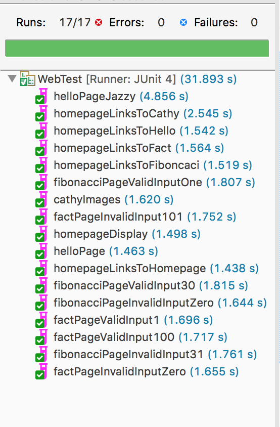

# Deliverable3

## Description of issues faced
Hello Dustin!

While this project took less time than project two, it definitely came with its own set of challenges.

Top challenges include:
* **Balance**: It was a challenge to ensure comprehensiveness of testing, not crushing our souls with the number of tests, and ensuring that we are covered all boundary/edge cases.
* **Hitting the 20-30 Test Specification**: We started off with 45 tests, combined to 14, then broke out into 17. Some tests felt like they could have multiple assertions, because if one failed the entire requirement was not met (i.e., all-or-nothing). The setup in an actual environment would be customized to what the testers wanted to have highlighted.
* **Knowing What to Test**: With the images, originally we had the impression that you wanted us to check if an image itself (something larger than a pixel was present), the ALT text was much easier to test.
* **Selenium Setup**: Selenium setup was fairly straight-forward (especially with your base-code), but we did have a minor issue getting started with Safari. Through downloading a new driver, we were able to resolve.
* **Not Being Tempted by Corner Cases**: We noticed some corner cases (inputing doubles and strings where they do not belong) that caused internal server errors. This is something we would probably address in a test plan and bring up to developers, but not include in our automated unit tests (until it was resolved).

No tests failed (once the Fibonacci requirement was dropped down to 30).

Thank you,

Steven and Alexis
