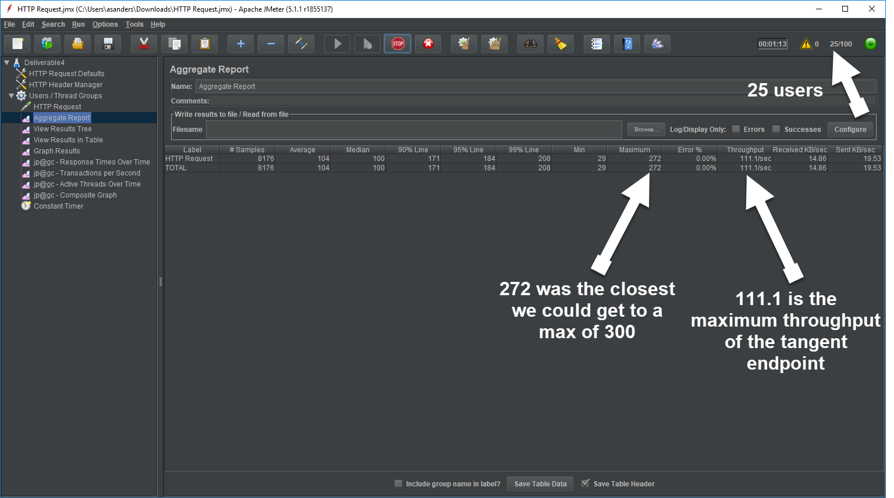
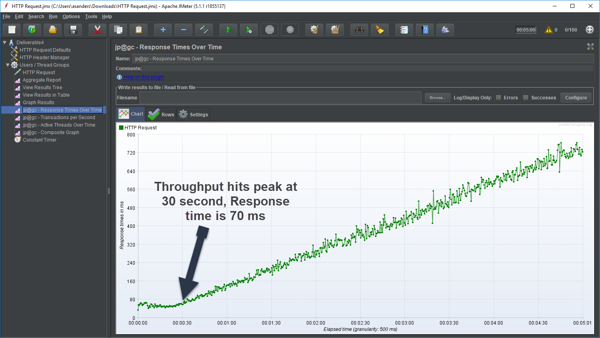
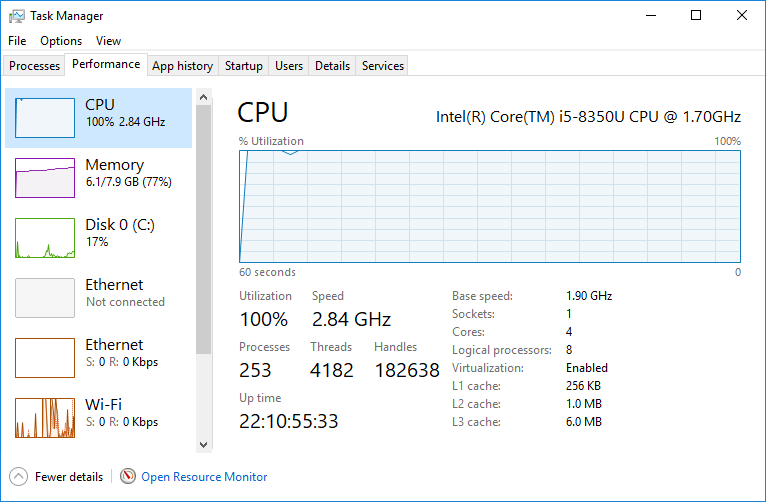
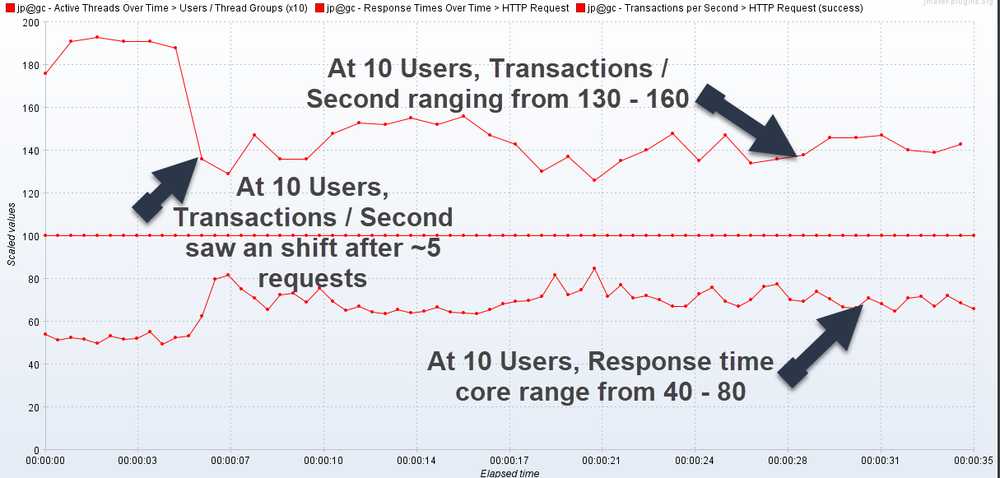
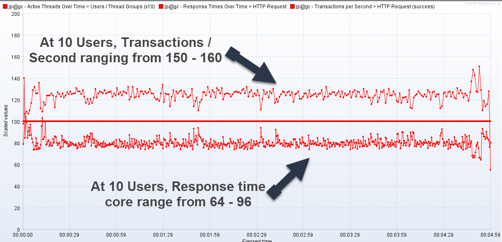
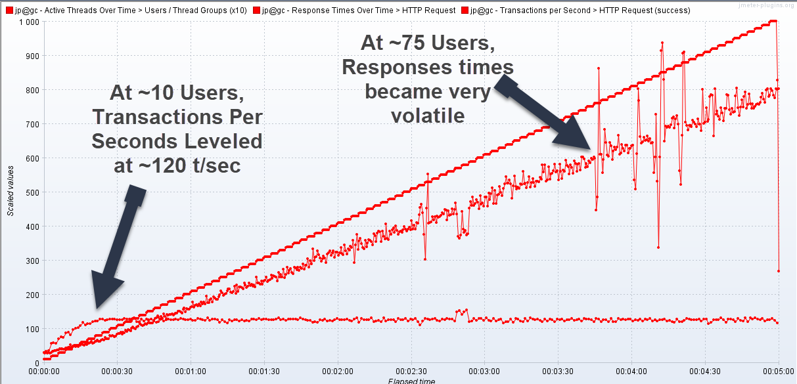
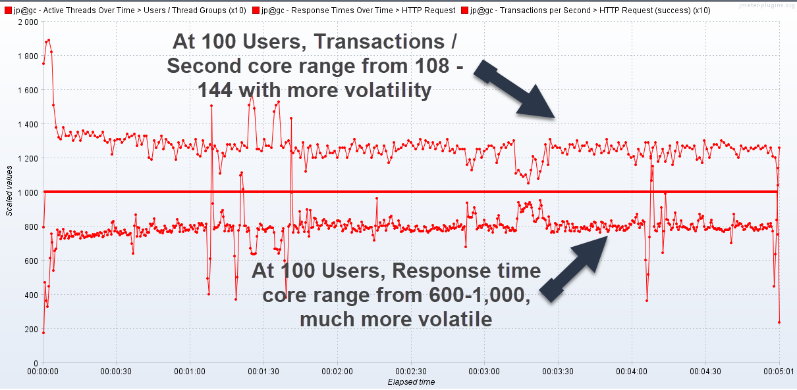

# Test Results

## Answers to Questions
* **What is the maximum throughput of the tangent endpoint?**
  * 111.1/sec (see image below)
* **Keeping the customers performance threshold in mind, what is the maximum number of users that can use the system?** 
  * 25 concurrent users, under 300 maximum (see image below)
   
* **What is the average response times of the tangent endpoint at its maximum throughput?**
  * 70 ms 
* **How much of your systems resources were consumed during the tests (cpu, memory, etc).**
  * We ran multiple tests while running multiple concurrent programs and decided those results were too inconsistent (may be because 100% of my CPU power was being used. In the end, I tried to keep Jmeter and the program running. This resulted in using about 100% of my CPU (1.70 GHz) and 5% of my memory. 
  

 ## Result Notes 
 * **Baseline Test:**
    * At 10 Users, Transactions / Second ranging from 130 - 160
    * At 10 Users, Transactions / Second saw an shift after ~5 requests
    * At 10 Users, Response time core range from 40 - 80

    
 * **Realistic Load:**
    * At ~10 Users, Transactions Per Seconds Leveled at ~120 t/sec
    * At ~75 Users, Responses times became highly volatile 

    
 * **Ramp Up:**
    * At 10 Users, Transactions / Second ranging from 150 - 160
    * At 10 Users, Response time core range from 64 - 96
 
      
 * **Stress Test:**
    * At 100 Users, Transactions / Second core range from 108 - 144 with more volatility
    * At 100 Users, Response time core range from 600-1,000, much more volatile

